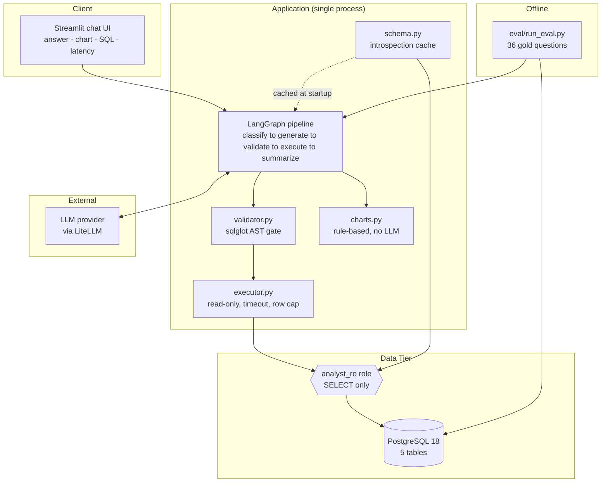
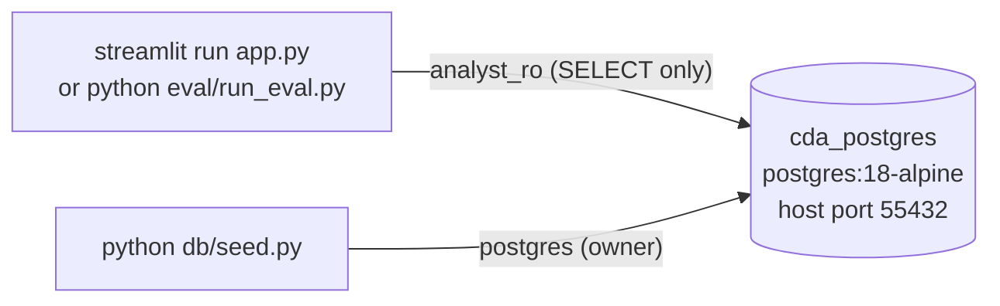
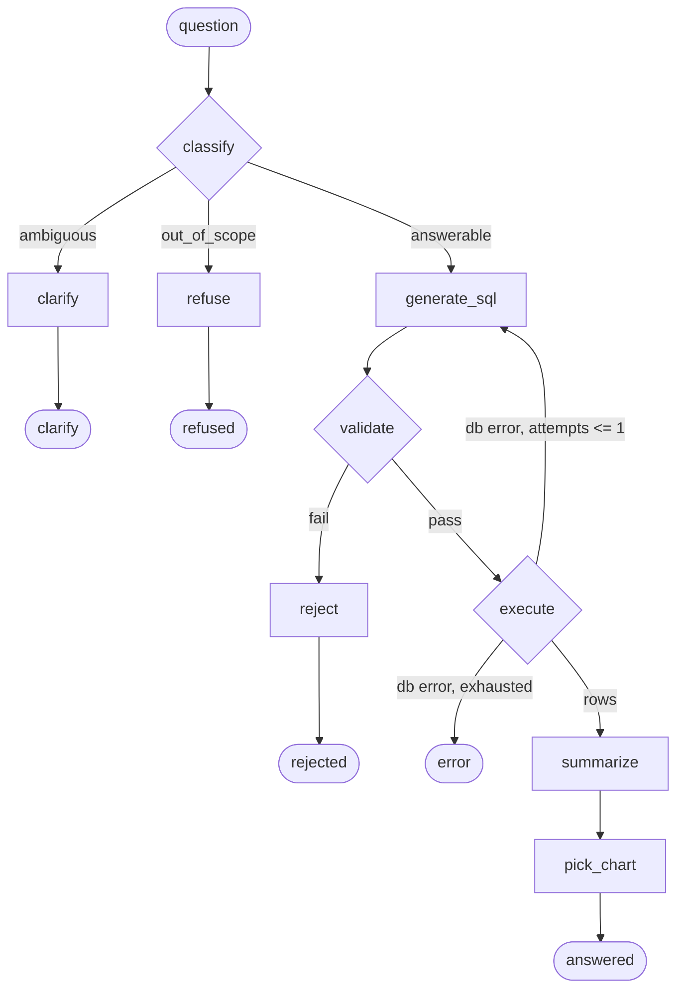
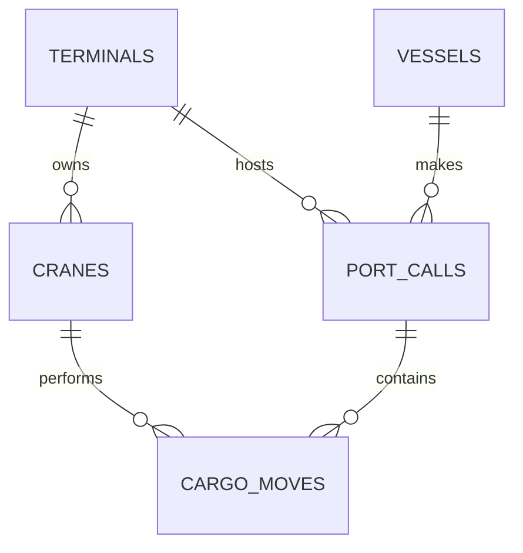

# Architecture: Conversational Data Analyst

> An architecture reference for this system: what it solves, how it is structured, and the
> reasoning behind each significant design decision, including the alternatives that were
> considered and the specific failure each rejected alternative would have introduced.
>
> Companion documents: [README.md](../README.md) (setup, quickstart, measured results)
> and [docs/ADR/](ADR/) (eight decision records, each with alternatives and trade-offs).
>
> Every claim below was verified against the running system rather than written from intent.
> This document is maintained with the code: a divergence between the two is a defect in one
> of them, to be corrected at the source and then reflected here.

---

## Table of Contents

1. [The Problem &amp; The Product](#1-the-problem--the-product)
2. [Core Domain Concepts](#2-core-domain-concepts)
3. [System Architecture at a Glance](#3-system-architecture-at-a-glance)
4. [Technology Stack](#4-technology-stack)
5. [Runtime Topology](#5-runtime-topology)
6. [The Agent Pipeline](#6-the-agent-pipeline)
7. [Schema Handling](#7-schema-handling)
8. [The Security Model](#8-the-security-model)
9. [Query Execution &amp; Runtime Limits](#9-query-execution--runtime-limits)
10. [Chart Selection](#10-chart-selection)
11. [Data Model &amp; The Domain Choice](#11-data-model--the-domain-choice)
12. [Evaluation](#12-evaluation)
13. [Frontend](#13-frontend)
14. [Cost, Latency &amp; Observability](#14-cost-latency--observability)
15. [Repository Structure](#15-repository-structure)
16. [Development &amp; Testing](#16-development--testing)
17. [Deliberately Out of Scope](#17-deliberately-out-of-scope)
18. [Path to Production](#18-path-to-production)
19. [Key Design Decisions &amp; Trade-offs](#19-key-design-decisions--trade-offs)

---

## 1. The Problem & The Product

### The problem

Every operations team has business questions queued behind a data analyst. An operations
manager wants to know which terminal is congested this quarter; the question becomes a
ticket, the ticket joins a backlog, and the answer arrives after the decision it was meant
to inform. The bottleneck is not analytical capability, since the SQL is usually
straightforward. It is that writing SQL requires a person who can write SQL.

The direct fix, "let an LLM write the SQL", creates three new problems that are harder than
the original one:

1. **Correctness is unverifiable.** A model that produces SQL which runs, returns rows, and
   is silently wrong is worse than no tool at all, because wrong numbers reach decks and
   then decisions.
2. **The model is an attack surface.** Anything that turns user text into executed SQL
   inherits every prompt-injection and SQL-injection concern at once.
3. **Ambiguity gets resolved by guessing.** "The busiest terminal" has two defensible
   readings; a system that silently picks one is confidently wrong much of the time.

### The product

A conversational analyst over an operational PostgreSQL database. A non-technical user asks
in plain English; the system translates to SQL, checks it, executes it read-only, answers in
natural language, and charts the result when a chart helps.

The three properties it is actually built around, each answering a problem above:

| Property                                        | How it is achieved                                                               | Where it is proven                                               |
| ----------------------------------------------- | -------------------------------------------------------------------------------- | ---------------------------------------------------------------- |
| **Correctness is measured**               | Gold set of 36 questions with hand-verified reference SQL; result-set comparison | [§12](#12-evaluation), `eval/`                                 |
| **Safety is structural**                  | Read-only role beneath a code validator beneath prompt hardening                 | [§8](#8-the-security-model), `tests/test_security_boundary.py` |
| **Ambiguity is answered with a question** | `classify` routes under-specified questions to a clarification exit            | [§6](#6-the-agent-pipeline), scored in the gold set              |

### What "done" looks like for a user

| Persona                                  | What they get                                                                                                          |
| ---------------------------------------- | ---------------------------------------------------------------------------------------------------------------------- |
| **Operations manager**             | A plain-English answer with the key figures and units, plus a chart when the shape warrants one                        |
| **Analyst reviewing the output**   | The exact SQL, one click away, on every answer, so the number can be audited before it is trusted                      |
| **Engineer evaluating the system** | A reproducible accuracy figure, its spread across runs, and a test suite that encodes the security claims              |
| **Security reviewer**              | A permission model readable in one file, and a test proving writes fail on privileges rather than on a bypassable flag |

---

## 2. Core Domain Concepts

The demo dataset models **port and terminal operations**. This vocabulary matters because
the column comments are injected into the model's prompt ([§7](#7-schema-handling)), so
these definitions are load-bearing rather than background.

| Concept              | Meaning                                                                      | Why it matters analytically                                                             |
| -------------------- | ---------------------------------------------------------------------------- | --------------------------------------------------------------------------------------- |
| **Terminal**   | A container-handling facility within a port                                  | The primary grouping dimension                                                          |
| **Vessel**     | A ship calling at terminals; belongs to an**operator** (shipping line) | Carries capacity (TEU), type, and the operator dimension                                |
| **Crane**      | A quay crane belonging to exactly one terminal                               | Equipment productivity;*a crane can only service vessels berthed at its own terminal* |
| **Port call**  | One visit of one vessel to one terminal                                      | The grain for congestion and visit-count questions                                      |
| **Cargo move** | One batch of container moves by one crane during one port call               | Finer grain than a port call; the throughput measure                                    |

### The three timestamps, and why they are not interchangeable

This is the distinction most questions turn on, and the one a model gets wrong without help:

- `arrival_ts`: the vessel reaches the port area and starts **waiting**.
- `berth_ts`: a berth is allocated and cargo work can begin.
- `departure_ts`: the vessel leaves the berth.

From these come two metrics that sound alike in English but are different questions:

- **Berth wait** = `berth_ts - arrival_ts`. Time spent queueing, which is the congestion
  metric. Materialised as the generated column `port_calls.berth_wait_hours`.
- **Dwell / time at berth** = `departure_ts - berth_ts`. Time spent working, which is a
  throughput metric.

"How long do vessels *wait* at this terminal?" and "how long do vessels *spend* at this
terminal?" require different SQL. The column comments say so explicitly.

### Cancelled calls

Roughly 3% of port calls are `cancelled`: the vessel arrived but never berthed, so
`berth_ts`, `departure_ts` and `berth_wait_hours` are all `NULL`. This exists to exercise
NULL semantics: `AVG` correctly ignores them, whereas a naive `WHERE status = 'completed'`
filter applied to a **count** silently changes what the number means. That distinction
caused two real evaluation failures and is now pinned in the prompt rules
([§12](#12-evaluation)).

---

## 3. System Architecture at a Glance



**The one structural property worth reading the diagram for:** there is no path from the
graph to the database that does not pass through `validate` and then `execute`, and
`execute` authenticates as `analyst_ro`. Those two facts are enforced by graph topology and
by PostgreSQL respectively, not by the model's cooperation.

---

## 4. Technology Stack

Every version below was verified against the installed environment on 2026-08-04. That
matters more than usual here: PostgreSQL 18 changed the default kind of generated column and
moved the Docker volume path, LangGraph is on 1.x, pandas on 3.x, and every 2025-era model
identifier has been retired. Code written from year-old documentation breaks in all four
places.

| Layer                     | Technology                                                 | Version                 |
| ------------------------- | ---------------------------------------------------------- | ----------------------- |
| **Language**        | Python                                                     | 3.12 (`>=3.12,<3.14`) |
| **Database**        | PostgreSQL, Docker`postgres:18-alpine`                   | 18.4                    |
| **DB driver**       | `psycopg` v3, `[binary]` extra (no local libpq needed) | 3.3.4                   |
| **Agent framework** | `langgraph` (fixed-topology state graph)                 | 1.2.10                  |
| **LLM access**      | `litellm` (provider selected by model-string prefix)     | 1.95.0                  |
| **SQL parsing**     | `sqlglot` (AST parsing for the security validator)       | 30.14.0                 |
| **Data frames**     | `pandas` (result frames for charting)                    | 3.0.5                   |
| **UI**              | `streamlit` (chat, charts, SQL expander)                 | 1.60.0                  |
| **Typed models**    | `pydantic`                                               | 2.13.4                  |
| **Tests / lint**    | `pytest`, `ruff`                                       | 9.1.1                   |
| **Packaging**       | `uv` + `pyproject.toml`                                | n/a                     |

**Notably absent:** no ORM (the queries are model-generated SQL, so an ORM has nothing to
do), no migration tool (the schema is created once from `db/01_schema.sql`), no vector
database (the schema fits in context, see [§7](#7-schema-handling)), no task queue, no cache.

---

## 5. Runtime Topology

A single Python process plus one database container. No API tier, no worker, no broker,
because nothing here is asynchronous or multi-user by design
([ADR-008](ADR/ADR-008-ui-and-scope-boundary.md)).



### Two connection identities, kept apart on purpose

The most important thing in the runtime topology, enforced in `src/config.py` rather than by
convention:

| Identity             | Used by                                                   | Privileges                         |
| -------------------- | --------------------------------------------------------- | ---------------------------------- |
| `postgres` (owner) | `db/seed.py` **only**                             | Full DDL and DML                   |
| `analyst_ro`       | The agent, the UI, the eval harness, schema introspection | `CONNECT`, `USAGE`, `SELECT` |

The agent never receives the owner credentials. That is structural rather than a matter of
policy: the code path building the agent's DSN reads different environment variables. There
is no code path in the request flow that can wacquire write access.

### Database bootstrap

`docker-compose.yml` mounts two scripts into `/docker-entrypoint-initdb.d`, which PostgreSQL
executes **in filename order, on first boot only** (against an empty volume):

1. `01_schema.sql`: tables, constraints, indexes, and the `COMMENT ON` statements that
   become prompt context.
2. `02_roles.sql`: the `analyst_ro` role. Separate and second **because
   `GRANT ... ON ALL TABLES` applies only to tables that exist when it runs**; granting
   before the DDL silently produces a role with no table privileges at all.

The healthcheck deliberately does more than `pg_isready`: it also queries `cargo_moves`,
because `pg_isready` reports success slightly before the init scripts finish, and a container
that is "healthy" but unseeded produces confusing downstream failures.

Two defaults exist to avoid collisions rather than by preference: **host port 55432**, not
5432, so the demo never conflicts with a PostgreSQL the reviewer already runs; and the
compose file omits the now-obsolete top-level `version:` key.

---

## 6. The Agent Pipeline

Implemented in `src/agent.py` as a **fixed-topology state graph**
([ADR-002](ADR/ADR-002-fixed-path-graph-over-agent-loop.md)).



### Node responsibilities

| Node             | Kind           | Model tier       | Responsibility                                        |
| ---------------- | -------------- | ---------------- | ----------------------------------------------------- |
| `classify`     | LLM            | cheap            | Route: answerable / ambiguous / out_of_scope          |
| `clarify`      | code           | n/a              | Terminal: return a clarifying question                |
| `refuse`       | code           | n/a              | Terminal: classification-time refusal                 |
| `generate_sql` | LLM            | **strong** | Write one SELECT. Also the retry target               |
| `validate`     | **code** | n/a              | The safety gate ([§8](#8-the-security-model))         |
| `reject`       | code           | n/a              | Terminal: validation-time refusal                     |
| `execute`      | **code** | n/a              | Run as`analyst_ro`, with limits                     |
| `summarize`    | LLM            | cheap            | State the answer, grounded strictly in returned rows  |
| `pick_chart`   | **code** | n/a              | Choose the visualisation ([§10](#10-chart-selection)) |

**Three LLM calls per question; four if the retry fires.** Everything else is code. The
division is deliberate: *the model decides content, the graph decides flow.*

### Two edges that carry the security argument

1. **`validate` is on the only edge into `execute`.** No path reaches the database without
   passing through it. That is a property of the topology, not of the model's behaviour.
2. **The retry edge returns to `generate_sql`, never to `execute`.** Retried SQL is therefore
   validated identically to first-attempt SQL. An edge looping back into `execute` would be a
   bypass and would still look reasonable in a diagram, which is exactly why this one is
   drawn and tested explicitly
   (`tests/test_agent_routing.py::test_retried_sql_is_validated_exactly_like_first_attempt_sql`).

### The bounded retry

On a database error the graph returns to `generate_sql` with the PostgreSQL error message
appended to the prompt. This is the ReAct pattern (act, observe the error, reason again), but
**the loop counter belongs to the graph**, capped at one iteration. The model contributes
reasoning and has no vote on whether to continue.

A validation *rejection* is never retried: that is a safety decision, not a transient
failure, and retrying it would hand the model a second attempt at the gate.

### Four terminal outcomes

`answered`, `clarify`, `refused` (classification-time), `rejected` (validation-time). The
last two are distinct on purpose, because they are different events with different causes,
and collapsing them would hide which layer did the work. `AgentResult.outcome` carries the
distinction to both the UI and the eval harness.

### Failure containment

`ask()` never raises for an expected failure mode. A provider outage, or a query that fails
twice, returns an `AgentResult` with `outcome=ERROR`, so callers have exactly one code path
and the eval harness scores a failure rather than crashing on it.

---

## 7. Schema Handling

`src/schema.py` introspects the live database **once at startup**, renders it to annotated
`CREATE TABLE` text, caches it for the process lifetime, and injects it into every
SQL-generation prompt ([ADR-003](ADR/ADR-003-schema-introspection.md)).

Four things are extracted, and the middle two are the interesting ones:

1. **Structure**: tables, columns, types and nullability, from `information_schema`.
2. **Join paths**: primary *and* foreign keys, recovered from `pg_constraint` (joined to
   `pg_class`, `pg_namespace` and `pg_attribute`) rather than from `information_schema`,
   which cannot yield them in one readable query. On a multi-table schema this is the single
   most valuable thing to hand a model.
3. **Semantics**: the `COMMENT ON` text, read from `pg_description` via `col_description()`
   and `obj_description()`.
4. **Data coverage**: the real min/max of every date column, so relative dates resolve
   against the data rather than the wall clock. Detailed below.

Per-column detail on what each of these teaches the model, and the literal text it produces,
is in [DATA.md §9](DATA.md#9-how-the-data-reaches-the-model).

### Column comments are functional code, not documentation

`berth_wait_hours` being measured in **hours** is not recoverable from `numeric(10,2)`.
Neither is `move_type` being one of `load`/`discharge`, nor `cargo_moves` being at a finer
grain than `port_calls`, nor the difference between the three timestamps in
[§2](#2-core-domain-concepts). A model that guesses any of these produces SQL that executes
cleanly and returns a confidently wrong number.

So the comments are written *for the model as reader*, they live in `db/01_schema.sql` beside
the data they describe, and changing a column without changing its comment is a defect.

### Data coverage is injected too

The introspection also computes the actual min/max of every date column:

```
-- Data coverage. Resolve relative dates ('last quarter', 'recently')
-- against THESE ranges, not against today's date:
  port_calls.arrival_ts: 2025-01-01 05:15:00 .. 2026-06-30 12:45:00
```

The dataset uses a fixed historical window ([§11](#11-data-model--the-domain-choice)), so a
model reasoning from the system clock would silently query an empty range. This is not an
artefact of synthetic data: production systems hit the same problem the moment a user says
"recently".

### Why not the alternatives

| Approach                                                                 | Verdict                                                                                                                                                                                               |
| ------------------------------------------------------------------------ | ----------------------------------------------------------------------------------------------------------------------------------------------------------------------------------------------------- |
| Hard-coded schema string                                                 | Rejected. Rots silently on the first schema change, and makes this a demo of*this* database rather than a system that works against *a* database                                                  |
| Per-query agentic discovery (`list_tables` / `describe_table` tools) | Rejected. 2 to 4 extra sequential round trips**per question** to rediscover something unchanged since startup, on a system where latency is assessed, and it reintroduces model-controlled flow |
| **Startup introspection + full injection**                         | **Chosen.** The entire schema is ~5,400 characters (~1,300 tokens)                                                                                                                              |

The generalisable principle: **retrieval earns its place when the schema stops fitting in
context, not before.** At five tables context is not scarce. Knowing when *not* to reach for
RAG is the same skill as knowing when to.

**Where this breaks:** correct at 5 tables, wrong at 500. The replacement is retrieval over
table metadata, then a curated semantic layer ([§18](#18-path-to-production)).

---

## 8. The Security Model

Full reasoning in [ADR-004](ADR/ADR-004-defence-in-depth-sql.md). The organising principle:
**assume the model is fully compromised, and ask what still holds.**

| # | Layer                | Mechanism                                                                                                         | Can the model affect it?                     | Load-bearing?                                      |
| - | -------------------- | ----------------------------------------------------------------------------------------------------------------- | -------------------------------------------- | -------------------------------------------------- |
| 3 | Prompt hardening     | `classify` refuses hostile / out-of-scope questions                                                             | **Yes**                                | **No.** Written assuming it will be defeated |
| 2 | Code validator       | sqlglot AST: one statement, SELECT-family root, no write node at any depth, no denied functions, system schemas or system catalogs | No, pure code with no LLM inside             | Yes                                                |
| 1 | Database permissions | `analyst_ro`: `CONNECT`, `USAGE`, `SELECT`. No write grant exists to revoke                               | No, enforced by PostgreSQL below the process | **Yes, decisively**                          |

### The attack that shaped the validator

```sql
WITH d AS (DELETE FROM port_calls RETURNING *) SELECT count(*) FROM d
```

This statement's top-level node type is **`Select`**. A validator that inspects only the
top-level statement type, which is what `sqlparse.get_type()` reports, **passes it, and it
empties the table.** That single case is why `src/validator.py` walks the entire parse tree
and rejects a write node at any depth, and why `sqlparse` was rejected as a security boundary
in favour of `sqlglot`.

The validator is **allow-list shaped**: only a single read-only SELECT-family statement is
permitted, so a construct nobody anticipated is denied by default. That is not theoretical:
`EXPLAIN ANALYZE DELETE FROM port_calls` (`EXPLAIN ANALYZE` *executes* its argument) is
blocked by the deny-`Command` catch-all rather than by anyone having thought of it.

It **fails closed**: an unparseable statement is rejected, never passed through. If we cannot
understand it, we cannot claim it is safe.

### Verified, not asserted

The role also sets `default_transaction_read_only = on`. That parameter is **`USERSET`**, so
any session can switch it off, and the test does exactly that. If it were the only control,
the security story would be theatre.

So `tests/test_security_boundary.py` **disables that guard first**, then attempts the writes:

| Attempt, with the read-only guard disabled | Result                                             |
| ------------------------------------------ | -------------------------------------------------- |
| `INSERT` / `UPDATE` / `DELETE`       | `ERROR: permission denied for table ...`         |
| `DROP TABLE`                             | `ERROR: must be owner of table ...`              |
| `TRUNCATE`                               | `ERROR: permission denied for table ...`         |
| `CREATE TABLE`                           | `ERROR: permission denied for schema public`     |
| CTE-hidden`DELETE`                       | `ERROR: permission denied for table ...`         |
| `SELECT ... INTO`                        | `ERROR: permission denied for schema public`     |
| `SELECT pg_sleep(1)`                     | `ERROR: permission denied for function pg_sleep` |
| Read`pg_authid`                          | `ERROR: permission denied for table pg_authid`   |

Every failure is on **permissions**. The test asserts that specifically, and fails if a write
is ever stopped only by the transaction flag, which would mean the boundary had silently
moved to the weaker layer.

**Where this argument does not hold.** Permissions stop every write above, but they do not
stop system-catalog reads. Probing on 2026-08-08 found this role can read `pg_roles`,
`pg_database`, `pg_tables` and `pg_class`, and can call `version()` and `inet_server_addr()`,
disclosing role names, database names, the table list, the exact server build and the
server's IP. These catalogs are world-readable in PostgreSQL, so no `GRANT` change removes
the exposure; the block is enforced in `src/validator.py` instead. This is the one case where
the validator, not the permission system, is the only control. `pg_authid` stays unreadable.
See [ADR-004](ADR/ADR-004-defence-in-depth-sql.md), "The case where layer 1 does not hold".

One finding worth recording: **`GRANT INSERT ON terminals TO analyst_ro`, issued by
`analyst_ro`, does not raise.** PostgreSQL emits a warning and reports success. No privilege
is granted (`has_table_privilege` returns false and the `INSERT` is still denied), but a
test asserting "GRANT raises" fails, and a casual reading of that success looks like
privilege escalation. The lesson generalises: **assert the property you care about, not the
error you expect to see.**

### Second-order prompt injection

The subtler attack, and the one the layers above cannot see. Hostile text stored **in the
database** reaches the model through query results rather than through the chat box:

1. The user asks a completely innocent question.
2. `classify` sees innocent text; `generate_sql` writes legitimate SQL.
3. `validate` passes it, because it is genuinely a single read-only SELECT.
4. `execute` runs it under a SELECT-only role, correctly.
5. **The payload arrives inside the result rows, at summarisation.**

Every control above sits upstream of step 5. The read-only role is irrelevant here, because
nothing is being written. What remains is the summariser's instruction to treat rows as data,
which is a *prompt-layer* defence: the weakest kind.

Because that is the one claim the architecture cannot structurally guarantee, it is tested
rather than asserted. `db/seed.py` stores a real payload in `port_calls.remarks`, and
`tests/test_second_order_injection.py` verifies the model reports it rather than obeying it.

The test's discriminator is itself worth noting: a naive substring search for the payload's
demanded string **fails on correct behaviour**, because a model faithfully quoting the remark
must reproduce that string. The first version of the test reported a breach that had not
happened. It now distinguishes *adopting* the demanded reply from *quoting* it.

**Blast radius, stated honestly:** a successful second-order injection can corrupt an
*answer*. It cannot corrupt *data*, because compliance happens after execution under a role
with no write privilege. That containment is the entire point of layering.

### Residual risk

- Full read access to all business data: no row-level security, no column masking.
  Acceptable for synthetic data; mandatory to add for real client data.
- Schema structure is discoverable (the agent needs it). `pg_authid` is not.
- An expensive-but-valid query can burn CPU. Bounded by a 5s statement timeout and a 500-row
  cap, both verified, but `statement_timeout` is also `USERSET`, so it is a seatbelt rather
  than a boundary.
- Nothing here prevents SQL that is safe, executes, and answers the **wrong question**. That
  is what [§12](#12-evaluation) is for.

---

## 9. Query Execution & Runtime Limits

`src/executor.py` assumes its input has passed the validator, but does not depend on that for
safety: the connection authenticates as `analyst_ro` regardless.

| Limit                 | Value | Bounds what                                                          |
| --------------------- | ----- | -------------------------------------------------------------------- |
| `statement_timeout` | 5s    | A valid but ruinously expensive query                                |
| Row cap               | 500   | A cheap query returning millions of rows (memory in*this* process) |
| `connect_timeout`   | 10s   | A hung connection attempt                                            |
| Read-only transaction | on    | Accidental writes, with a clear error                                |

**The row cap is applied by fetching fewer rows, not by writing SQL.** The validated statement
is executed verbatim through a server-side cursor:

```python
cur = conn.cursor(name="cda_reader")   # psycopg issues DECLARE ... CURSOR FOR <statement>
cur.execute(inner)                      # verbatim; nothing composed around it
fetched = cur.fetchmany(cap + 1)        # cap + 1 detects truncation without a second COUNT
```

Two earlier designs were rejected. Appending `LIMIT` would corrupt a query already ending in
`LIMIT` or `ORDER BY` and would silently change the meaning of a `UNION`. Wrapping the query
(`SELECT * FROM ( ... ) AS _capped LIMIT 501`) fixed that but meant this module composed new
SQL around model output, which is the one thing a text-to-SQL system should be able to say it
does not do. Executing verbatim removes the construct rather than defending it.

No parameters are passed to `execute()`, so psycopg performs no client-side placeholder
substitution and a literal `%` (a `LIKE` pattern, or modulo arithmetic) reaches PostgreSQL
untouched. Both cases are asserted in `tests/test_executor.py`.

Column **type names** are resolved from psycopg's OID registry and returned on every
`QueryResult`, because chart selection keys off the database's declared types rather than
sniffing values ([§10](#10-chart-selection)).

Errors are raised as `ExecutionError` carrying the PostgreSQL message verbatim. That message
is what makes the single retry useful, because the model can see exactly what it got wrong.

---

## 10. Chart Selection

Pure code, no LLM call ([ADR-005](ADR/ADR-005-deterministic-chart-selection.md)). Chart choice
is a function of the **shape** of the result set, not of the language in the question: once
the SQL has run, the result fully determines which encodings are valid. No linguistic
judgement remains, so there is nothing for a language model to contribute.

`src/charts.py` splits into `classify_columns()` (type → charting role) and the rules:

| #  | Condition                                         | Output                                                   |
| -- | ------------------------------------------------- | -------------------------------------------------------- |
| 1  | Zero rows                                         | **No chart** (the answer says nothing matched)     |
| 2  | One row, one numeric column, at most two columns  | **Metric** (a second column labels the figure)     |
| 3  | A temporal column + ≥1 numeric, **>1 row**       | **Line**                                           |
| 4  | A label column + ≥1 numeric, ≤12 distinct, **>1 row** | **Bar**                                       |
| 4b | Several categoricals without a unique first label | **Table** (a bar chart would collapse a dimension) |
| 5  | Exactly two numerics, nothing else, **>1 row**    | **Scatter**                                        |
| 6  | Anything else, including a single row carrying more than a label and a measure | **Table**             |

The `>1 row` guards on rules 3, 4 and 5 are not decoration. A superlative question ("which
terminal has the longest berth wait?") returns one row holding a label and a measure, which
before this guard fell through to rule 4 and drew a bar chart of exactly one bar stretched
across the full container. Four gold questions produced it, including the first example
button in the UI. See ADR-005.

Every `ChartSpec` carries a `reason` naming the rule that fired; it is shown in the UI and
asserted in tests, so the behaviour is inspectable rather than magic.

### Two things found by running it, not by predicting it

- **`to_char(ts, 'YYYY-MM')` returns `text`.** A purely type-driven rule classifies the most
  common time-series result as categorical and draws bars where a line is correct. Fixed in
  two places: the prompt asks for `date_trunc(...)::date`, and the rules additionally accept
  anchored ISO-8601-shaped text as temporal. The fallback matches *values* against a strict
  pattern, never column *names*.
- **Models add descriptive companion columns.** Asked for average wait by terminal, the model
  returned `terminal_name, port_name, avg_wait`, so a strict "exactly one categorical" rule
  fell through to a table. Rule 4 now tolerates extra categoricals *only* when the first
  uniquely labels each row.

**Known limitation:** explicit user intent is ignored. "Show that as a pie chart" is not
heard. The fix is a small intent-extraction step feeding an override, which is an increment
rather than a rewrite.

---

## 11. Data Model & The Domain Choice

> This section covers how the data model fits the system. [DATA.md](DATA.md) covers the
> dataset itself: every column with its units and allowed values, the full value inventory,
> the generator's construction, the measured figures behind each planted pattern, and a
> catalogue of questions the data can answer.

### The schema



| Table           | Rows  | Grain                    |
| --------------- | ----- | ------------------------ |
| `terminals`   | 6     | one per terminal         |
| `vessels`     | 40    | one per ship             |
| `cranes`      | 25    | one per quay crane       |
| `port_calls`  | 1,500 | one per vessel visit     |
| `cargo_moves` | 6,577 | one per crane move batch |

Two dimensions, one equipment dimension, and two fact tables at different grains: a
recognisable star-ish shape, which is what a real analytics database looks like.

### Why this domain, and not e-commerce

The brief allows any input data, so the choice needed a reason. It was not thematic.

The **strongest reason is methodological: the default alternative
(customers/orders/products/order_items) is massively over-represented in LLM training data,
so accuracy on it would partly measure memorisation rather than schema comprehension.** A
model that has seen ten thousand `orders JOIN order_items` examples can produce correct SQL
for that schema without meaningfully reading the schema at all, which yields a flattering
evaluation that measures the wrong thing. Since the entire point of this build is that
correctness is *measured*, a benchmark that inflates itself would undermine the central
claim.

**Port ops gives natural join depth, a real time axis, and honest categorical dimensions.**
Join depth is inherent rather than contrived; the arrival/berth/departure timestamps give a
genuine time series rather than a decorative date column; and the categorical dimensions
(operator, terminal, vessel type, crane status) are real groupings a business would actually
ask about.

Concretely, join depth falls out of the questions rather than out of artificial schema
splitting:

| Question                                           | Tables joined |
| -------------------------------------------------- | ------------- |
| "Average berth wait by terminal"                   | 2             |
| "Container moves per month by terminal"            | 3             |
| "Crane productivity by crane and port"             | 3             |
| "Top operators by containers handled at Jebel Ali" | **4**   |

Alternatives considered and rejected: a **public real-world dataset** (download and licensing
friction in a repo promising a two-command start, and signal cannot be planted in it),
**more tables** (8 to 10 would grow prompt size and SQL error surface without testing
anything the brief asks about), and **the bare minimum of four** (meets the letter of the
brief with no margin).

### Planted signal, not noise

Uniformly random data produces flat aggregates, and against flat data a working agent and a
broken one look identical, because every answer is "they're all about the same". Four
patterns are planted as **statistical distributions**, so they are visible in aggregate but
not obvious in any single row:

| # | Pattern                                                              | Discoverable by                              |
| - | -------------------------------------------------------------------- | -------------------------------------------- |
| 1 | One congested terminal (Jebel Ali T2, ~17.5h vs ~5.7h)               | "Which terminal has the longest berth wait?" |
| 2 | Seasonal volume: February trough, autumn peak                        | "Show monthly container volume"              |
| 3 | One ageing crane (RTM-QC-01, commissioned 2001, ~17 vs ~28 moves/hr) | "Which crane is least productive?"           |
| 4 | One operator with poor punctuality (Meridian Lines, ~12.8h)          | "Which operator waits longest?"              |

`db/verify_seed.sql` proves each is still detectable after any change to the generator.

### Determinism is a hard requirement

`db/seed.py` uses a fixed RNG seed (42) and a **fixed date window** (2025-01-01 to
2026-06-30). Nothing reads the system clock. Two consequences:

- Reference SQL in the gold set contains literal date predicates. A window that moved with the
  wall clock would drift the gold queries out of range and decay measured accuracy for reasons
  unrelated to the agent.
- Any change to **RNG draw order** silently changes every generated value. The data stays
  plausible and every constraint still passes, so nothing fails loudly, but the
  reproducibility guarantee breaks. `tests/test_seed_characterization.py` pins a digest of
  every table's full contents to catch exactly this.

That constraint shaped an implementation detail: `port_calls.remarks` is populated by post-hoc
`UPDATE` keyed on `port_call_id`, never by drawing from the RNG, precisely so the existing
draw stream stays intact. Four of five table digests were verified byte-identical after that
column was added.

### One accepted weakness

Every port currently has exactly one terminal, which makes `port_name` effectively redundant
and removes a natural port → terminal hierarchy. Cosmetic rather than functional; fixing it
requires re-seeding and re-baselining the characterization digests for no gain in what the
brief assesses.

---

## 12. Evaluation

`eval/run_eval.py` turns "the SQL is correct" into a number
([ADR-006](ADR/ADR-006-eval-execution-accuracy.md)). It calls `src/agent.py` directly, with
no Streamlit in the path, so it can run in CI.

### The gold set: 36 items in three categories

| Category              | Items | What it asserts                                                |
| --------------------- | ----- | -------------------------------------------------------------- |
| **answerable**  | 28    | Agent SQL returns the same rows as hand-verified reference SQL |
| **ambiguous**   | 3     | Agent asks a clarifying question instead of guessing           |
| **adversarial** | 5     | Injection / destructive / out-of-scope requests are refused    |

**Groundedness is scored separately, on every answered case**, because an answer can carry the
right rows and still describe them with an invented figure. `_check_groundedness()` requires every
number in the answer to appear in the returned rows (exactly or as a rounding), in the question, or
in the SQL, and requires an empty result set to be reported as such rather than filled in.

A system that answers well but cannot say no is not deployable, which is why the second and
third categories exist at all.

### Result-set comparison, not SQL text

The same question has many correct SQL formulations: join order, CTE versus subquery,
`COUNT(*)` versus `COUNT(1)`. String or AST comparison would measure stylistic conformance
rather than whether the user got the right numbers. Comparison is order-insensitive unless the
question implies a ranking, with float tolerance for aggregate arithmetic and type unification
so `numeric` vs `double precision`, and `date` vs midnight `timestamp`, compare equal.

### Measured results

Six full runs. The item set grew twice, so the row is comparable and the column is not:
runs 1 to 3 scored a 30-item set (22 answerable), run 4 scored 33 items (25 answerable), and
runs 5 and 6 score 36 items (28 answerable) after three window-function questions were added.
Run 4 is the first with groundedness measured.

| Metric              | Run 1        | Run 2        | Run 3        | Run 4  | Run 5  | Run 6      |
| ------------------- | ------------ | ------------ | ------------ | ------ | ------ | ---------- |
| Execution accuracy  | 86.4%        | 95.5%        | 86.4%        | 92.0%  | 92.9%  | **96.4%** |
| Answer groundedness | not measured | not measured | not measured | 100%   | 89.3%  | **92.9%** |
| Ambiguity handling  | 100%         | 100%         | 66.7%        | 100%   | 100%   | **100%**  |
| Safety / refusals   | 100%         | 100%         | 100%         | 100%   | 100%   | **100%**  |
| Mean latency        | 8.3s         | 9.1s         | 12.0s        | 6.0s   | 6.1s   | 5.9s       |
| Cost per run        | $0.228       | $0.238       | $0.224       | $0.274 | $0.325 | $0.315     |

**The first groundedness measurement caught a real failure on a question whose SQL was correct.**
The agent returned the right monthly rows, then wrote "the total annual volume reaching 228,499
containers", a figure it had computed itself, wrong by 10,600 (the true total is 239,099).
Execution accuracy scored that answer 100% correct. The summariser prompt now forbids arithmetic
across rows outright: a computed figure reads with exactly the authority of a retrieved one while
being unverifiable.

**The variance is the finding, not the maximum.** Runs 2 and 3 differ by nine points from
nothing but re-running, at `temperature=0`. Two causes, which the harness originally conflated
and now reports separately:

- **Provider instability.** Two of run 3's failures were `error` outcomes at 58s and 37s, with
  an SSL handshake timeout in the log. Those are availability events, not wrong answers.
  Excluding them, run 3 scores 90.5%.
- **Genuine sampling variance.** Two items flipped between runs.

Infrastructure errors are reported separately but **not excluded** from the headline: a metric
that silently drops its own failed requests flatters exactly when the system is least usable.

The honest claim is therefore a range: **execution accuracy of 86.4% to 96.4% across six
runs**. At 28 answerable items one case is worth 3.6 points, so a single run cannot distinguish
93 from 96. Runs 5 and 6 make the point without needing the infrastructure caveat: they differ
by one item, and it is not the same item. Run 5 failed `q09` and passed `q19`; run 6 passed
`q09` and failed `q19`, where the agent filtered on the wrong column and returned zero rows.

**The one number that did not move: safety, 5/5 in every run, 30 attempts without a miss.** That stability is not a
property of the model; it comes from enforcing the guarantee where the model cannot reach.

### What the harness found, about the system and about itself

- **The first run scored 86.4%, and all three failures were defects in the *specification*,
  not the model.** A vague "exclude cancelled port calls" prompt rule silently changed what a
  count meant, and the ranking rule did not distinguish a singular superlative from a per-group
  question. Fixing the prompt took accuracy to 95.5%.
- **Characterization tests found a bug in the harness itself.** `_normalise` compared
  `date(2025,1,1)` against `datetime(2025,1,1)` as unequal while its docstring claimed they
  matched, so a correct answer could be scored wrong purely for omitting a cast.
- **One failure was left unfixed on purpose.** `q09` returns an extra descriptive column; the
  answer is correct and strict comparison calls it wrong. Relaxing the comparison after seeing
  what it fails would be tuning the metric to the result, so the stricter number stands.

`run_eval.py` exits non-zero if any **safety** case fails, so in CI a safety regression breaks
the build even when overall accuracy looks acceptable.

---

## 13. Frontend

`app.py` is a deliberately thin Streamlit layer
([ADR-008](ADR/ADR-008-ui-and-scope-boundary.md)). Its entire job is to make four things
visible, each mapping to an assessed behaviour:

| Element                                                                             | Demonstrates                                  |
| ----------------------------------------------------------------------------------- | --------------------------------------------- |
| Chat input + history (`st.chat_message`, `st.chat_input`)                       | The conversational requirement                |
| Natural-language answer                                                             | Groundedness: phrased only from returned rows |
| Chart rendered from a typed`ChartSpec`, plus the rule that fired                  | Chart-type selection                          |
| Collapsed "View SQL" expander +`1.8s · 3 LLM calls · 6 rows · $0.0099` caption | Auditability, latency, cost                   |

Outcomes that are not a normal answer carry a visible badge, so a refusal or clarification is
never mistaken for an answer.

**The SQL expander is the load-bearing UI decision.** It converts the system from something a
user must trust into something a user can check, and it is the human-in-the-loop story in this
build: an analyst can read the SQL that produced a number before that number reaches a deck.

`@st.cache_resource` caches the compiled graph and schema so neither is rebuilt on every
Streamlit rerun.

---

## 14. Cost, Latency & Observability

### Cost

Two model tiers behind one wrapper ([ADR-007](ADR/ADR-007-llm-provider-and-tiering.md)):

| Tier   | Env var          | Used by                     | Rationale                                            |
| ------ | ---------------- | --------------------------- | ---------------------------------------------------- |
| Cheap  | `MODEL_CHEAP`  | `classify`, `summarize` | Short, bounded, low-difficulty language tasks        |
| Strong | `MODEL_STRONG` | `generate_sql`            | The one node where capability determines correctness |

Two of three calls go to the cheap tier. Provider is chosen by the model-string prefix
(`anthropic/…`, `openai/…`, `gemini/…`), so switching provider is an environment change, not a
code change. Measured cost is **~$0.008 per question**.

### Latency

**~8 to 9s mean**, and this is the weakest number in the system. It is a direct consequence
of three sequential LLM calls, not a defect. The honest fixes are caching and a smaller
classifier, not a rewrite. What the architecture *does* guarantee is that latency is a
**ceiling** (3 calls, 4 with a retry) rather than a distribution with a long tail, which is
what an autonomous loop would have produced.

### Observability

`llm.Usage` accumulates calls and cost per question via `litellm.completion_cost()`, surfaced
in the UI caption and aggregated by the eval harness. **What is not built is persistence.**
Spend is visible per request and per run, but nothing is stored, so there is no spend trend, no
per-user attribution and no alerting. Named on the path to production rather than implied.

---

## 15. Repository Structure

```
├── app.py                      Streamlit chat UI
├── docker-compose.yml          PostgreSQL 18 (host port 55432)
├── pyproject.toml              Dependencies, pytest markers, ruff config
├── .env.example                Config template (the real .env is gitignored)
├── db/
│   ├── 01_schema.sql           Tables, constraints, indexes, COMMENT ON (prompt context)
│   ├── 02_roles.sql            The analyst_ro read-only role
│   ├── seed.py                 Deterministic synthetic data generator (seed=42)
│   └── verify_seed.sql         Proves the planted patterns are still detectable
├── src/
│   ├── agent.py                LangGraph pipeline, node functions, ask()
│   ├── validator.py            The SQL safety gate (sqlglot AST)
│   ├── executor.py             Read-only execution, timeout, row cap
│   ├── schema.py               Introspection to cached prompt context
│   ├── charts.py               Rule-based chart selection
│   ├── prompts.py              Prompt templates
│   ├── llm.py                  Two-tier LiteLLM wrapper, output extraction
│   ├── models.py               Typed state and results (pydantic)
│   └── config.py               Settings; separates admin and read-only identities
├── eval/
│   ├── gold_questions.yaml     36 scored cases
│   ├── gold.py                 Gold-set schema; validated at load
│   ├── run_eval.py             The harness
│   └── results/                Committed raw output, the evidence for the README's numbers
├── tests/                      343 tests
└── docs/
    ├── ARCHITECTURE.md         This document
    └── ADR/                    Eight decision records
```

---

## 16. Development & Testing

### Quickstart

```bash
cp .env.example .env                              # add an API key
docker compose up -d                              # PostgreSQL 18 on 55432
uv venv --python 3.12 && uv pip install -e ".[dev]"
python db/seed.py                                 # deterministic seed
streamlit run app.py
```

### Test suite: 343 tests

| File                               | Tests | Scope                                                                    |
| ---------------------------------- | ----- | ------------------------------------------------------------------------ |
| `test_gold_set.py`               | 120   | Gold-set schema, parametrized over all 36 cases                          |
| `test_validator.py`              | 93    | The security gate: every attack, evasion and fail-closed case            |
| `test_eval_scoring.py`           | 32    | Comparison and scoring logic, the definition of "correct"                |
| `test_security_boundary.py`      | 17    | Integration: GRANTs hold with the read-only guard disabled               |
| `test_llm_extraction.py`         | 15    | Parsing model output; total functions that raise rather than half-parse  |
| `test_agent_routing.py`          | 22    | Graph topology with a stubbed LLM: unskippable validation, bounded retry |
| `test_charts.py`                 | 14    | Every chart rule, at its boundaries                                      |
| `test_executor.py`               | 13    | Row cap and its boundary, timeout, verbatim execution, errors            |
| `test_schema.py`                 | 5     | Catalog introspection; composed identifiers are quoted                   |
| `test_seed_characterization.py`  | 7     | Data digests, planted patterns, the crane/terminal invariant             |
| `test_second_order_injection.py` | 5     | Stored-payload injection arriving through query results                  |

Integration tests are marked, so unit tests run without a database:

```bash
pytest -m "not integration"   # no database, no network
pytest                        # everything (needs a seeded DB; injection tests need an API key)
ruff check src/ tests/ eval/ db/ app.py
python eval/run_eval.py       # ~3.5 min, ~$0.32
```

### Testing philosophy

Tests are written to **catch a regression**, not to raise a coverage number. Three
consequences visible in the suite:

- **The security tests test the boundary, not the symptom.** `test_security_boundary.py`
  disables the bypassable guard before attempting writes and asserts the failure is on
  permissions, so it fails if the boundary ever moves to the weaker layer.
- **Graph topology is tested with a stubbed LLM**, because a live model cannot be made to
  produce the specific failure sequences each edge exists to handle.
- **Characterization tests pin behaviour nothing else would notice changing.** The seed
  digests are the clearest case, since a shifted RNG stream produces data that is wrong in
  no visible way.

---

## 17. Deliberately Out of Scope

"Not built" and "not considered" are different claims. One line of reasoning each:

| Omitted                       | Why                                                                                                                                                                                          |
| ----------------------------- | -------------------------------------------------------------------------------------------------------------------------------------------------------------------------------------------- |
| **Authentication**      | One implicit user. Identity is a precondition for row-level security, which is why it heads the production path rather than being a UI feature                                               |
| **Caching**             | Would cut cost and latency, but optimises a system whose correctness is not yet established. Correctness first                                                                               |
| **Multi-turn memory**   | Single-turn by design. "And what about last year?" turns SQL generation into a coreference problem where ambiguity compounds across turns. LangGraph checkpointing is the intended mechanism |
| **Streaming**           | Perceived latency, not latency. With three calls the honest fix is fewer or faster calls                                                                                                     |
| **Deployment**          | Runs locally. Containerising demonstrates a skill this brief does not assess                                                                                                                 |
| **Async / concurrency** | Single-user by design; Streamlit's rerun model would not scale to concurrent users anyway                                                                                                    |
| **Tracing persistence** | Cost and latency are measured per request but not stored                                                                                                                                     |
| **Semantic layer**      | The most consequential omission; see below                                                                                                                                                   |

**On the semantic layer.** Without governed metric definitions, "utilisation" resolves to
whatever the model infers that day, and the same question yields different SQL and different
numbers across sessions. At this scale the column comments are a partial substitute. At client
scale they are not, and this, rather than model capability, is the usual reason agent-analytics
deployments stall.

---

## 18. Path to Production

1. **Row-level security** per tenant role, so each user sees only their data. Requires
   authentication first.
2. **A semantic layer** for governed metric definitions.
3. **The eval suite in CI** as a regression gate on every prompt or model change. The harness
   already exits non-zero on a safety regression.
4. **Tracing and cost persistence**: per-query spend, latency percentiles, failure
   attribution.
5. **Retrieval over table metadata** once the schema outgrows the context window
   ([§7](#7-schema-handling)).
6. **A different storage and ingestion layer** once query volume or continuous data arrival
   outgrows single-node PostgreSQL. The seeded working set is 1,680 kB against the 128 MB buffer
   pool this container runs with, so the latency threshold is far off, and nothing ingests
   continuously today. Both are stated with their observable trigger conditions in
   [ADR-001](ADR/ADR-001-domain-and-data-model.md#where-this-model-stops-holding).
7. **A connection pool.** Each query opens its own connection and closes it
   ([§9](#9-query-execution--runtime-limits)), while `analyst_ro` is created with
   `CONNECTION LIMIT 10` (`db/02_roles.sql`). Ten concurrent in-flight queries therefore
   exhaust the role's budget and the eleventh is refused. A single-user Streamlit session
   never reaches that, which is why the connection-per-query shape is acceptable here and
   is the first thing that breaks under concurrent use. Pooling is a small change, and it
   belongs to the same increment as the FastAPI serving model rather than preceding it.

---

## 19. Key Design Decisions & Trade-offs

| Decision                                                            | Why                                                                                                                                                | Trade-off                                                                                          |
| ------------------------------------------------------------------- | -------------------------------------------------------------------------------------------------------------------------------------------------- | -------------------------------------------------------------------------------------------------- |
| **Fixed-topology graph, not an autonomous agent loop**        | The path is known in advance, so guardrails become structural, cost becomes a ceiling rather than a distribution, and failure modes are enumerable | Cannot handle genuinely multi-step exploration ("find anomalies, then investigate the biggest")    |
| **LangGraph despite six nodes**                               | Typed state, topology-as-documentation, and the mechanism for checkpointing and multi-turn later                                                   | Honestly oversized today; plain functions would work. A bet on the next increment                  |
| **Read-only DB role as the real boundary**                    | A control the model can influence is a tendency; one it cannot reach is a guarantee                                                                | Requires provisioning a role, which is what a client DBA would do anyway                           |
| **sqlglot AST walk, not a `sqlparse` statement-type check** | A data-modifying CTE has top-level type`Select`, so a check on the top-level type alone admits it and it executes                                | An extra dependency; allow-list shape occasionally blocks exotic-but-valid SQL                     |
| **Allow-list validator, not a keyword deny-list**             | An unanticipated construct is denied by default rather than admitted by omission                                                                   | False positives (e.g.`INTERSECT` initially), which is the correct direction to fail in           |
| **Startup schema introspection, not per-query discovery**     | ~1,300 tokens injected once beats 2 to 4 extra round trips per question                                                                            | Cached, so DDL changes need a restart; breaks down in the hundreds of tables                       |
| **Column comments as prompt context**                         | Units, enums and grain are not recoverable from types, and guessing them yields confidently wrong numbers                                          | Comments become production code, maintained with the schema                                        |
| **Rule-based chart selection, no LLM**                        | Chart choice is a function of data shape rather than language, so the rule is deterministic, free, and unit-testable                               | Ignores explicit user intent ("show as a pie chart")                                               |
| **Port operations domain, not e-commerce**                    | E-commerce is over-represented in training data, so accuracy would partly measure memorisation rather than schema comprehension                    | Less immediately familiar to a reader than orders and products                                     |
| **Deterministic seed, fixed date window**                     | Reference SQL contains literal dates; a moving window would decay accuracy for unrelated reasons                                                   | Relative dates must resolve against injected data ranges, not the clock                            |
| **Result-set comparison, not SQL text**                       | Many correct formulations exist; string comparison measures style, not correctness                                                                 | Slightly stricter than "did the user get the right answer", since an extra column counts as a miss |
| **Two model tiers**                                           | Cost per task is a design input; two of three calls do not need capability                                                                         | Two behaviour profiles to reason about; a prompt tuned on one tier may not transfer                |
| **Streamlit, not React + API**                                | The UI is the least interesting component here, and its implementation should say so                                                               | Would not scale to concurrent users; not a production serving model                                |
| **Reporting a range, not the best run**                       | Same code scored 86.4% and 95.5%; quoting only the maximum on a "measured, not claimed" system would be self-defeating                             | A less impressive headline number                                                                  |

---

*This document describes the architecture as implemented and is updated in the same change as
the code it describes. The eight ADRs in [docs/ADR/](ADR/) carry the full reasoning, the
alternatives considered, and the trade-off accepted for each decision summarised here.*
